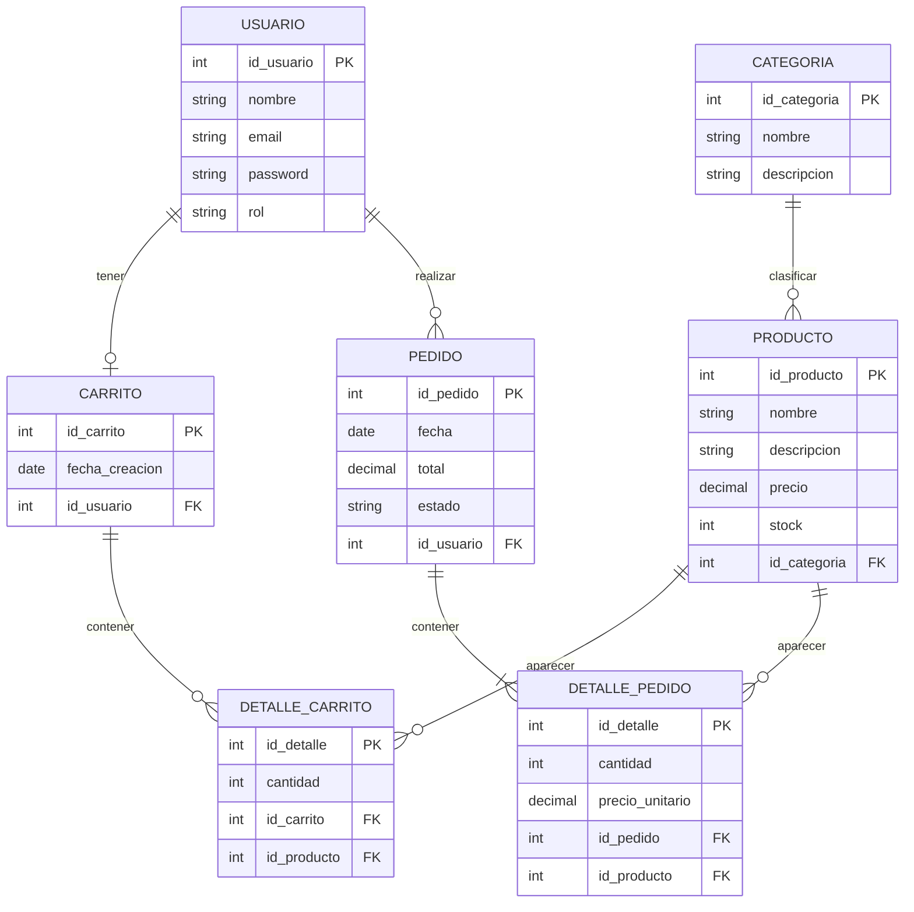

# Diagrama entidad-relacion

Este diagrama representa las entidades principales de La Pitayera y las relaciones entre ellas.

```mermaid
erDiagram
    USUARIO {
        int id_usuario PK
        string nombre
        string email
        string password
        string rol
    }

    CATEGORIA {
        int id_categoria PK
        string nombre
        string descripcion
    }

    PRODUCTO {
        int id_producto PK
        string nombre
        string descripcion
        decimal precio
        int stock
        int id_categoria FK
    }

    CARRITO {
        int id_carrito PK
        date fecha_creacion
        int id_usuario FK
    }

    DETALLE_CARRITO {
        int id_detalle PK
        int cantidad
        int id_carrito FK
        int id_producto FK
    }

    PEDIDO {
        int id_pedido PK
        date fecha
        decimal total
        string estado
        int id_usuario FK
    }

    DETALLE_PEDIDO {
        int id_detalle PK
        int cantidad
        decimal precio_unitario
        int id_pedido FK
        int id_producto FK
    }

    USUARIO ||--o| CARRITO : tener
    CARRITO ||--o{ DETALLE_CARRITO : contener
    PRODUCTO ||--o{ DETALLE_CARRITO : aparecer

    USUARIO ||--o{ PEDIDO : realizar
    PEDIDO ||--|{ DETALLE_PEDIDO : contener
    PRODUCTO ||--o{ DETALLE_PEDIDO : aparecer

    CATEGORIA ||--o{ PRODUCTO : clasificar
```